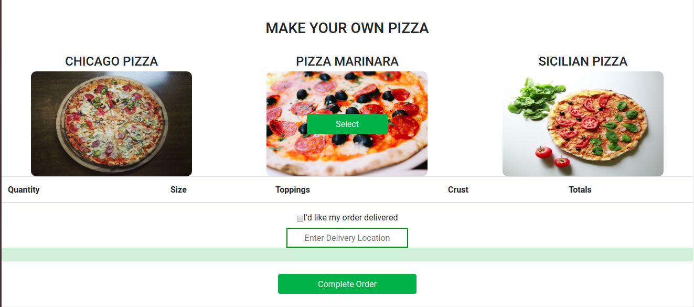

# Pizza Heart

A web app for a pizza company where customers can order pizzas online. They can select the size of pizza, the toppings they want and even the crust. After adding the items to cart, the can view what they have added. The can opt for delivery at their specified location.

## Technologies Used

- HTML & CSS (Bootstrap)
- JavaScript (jQuery 3.4.1)
- Vanilla JS

##### Requirements

A modern web browser

##### Setup Instructions and Installation

- To use this app online, just visit the link [here](https://mantongash.github.io/pizza-heart/)

- To use this app offline, clone this repository to a location in your file system. `https://github.com/Mantongash/pizza-heart.git`
- Open terminal command line then navigate to the root folder of the application. `cd pizza-heart`
- Open `index.html` on your Browser.

## Behaviour Driven Development

1. User makes their order
   - INPUT: Pizza size
   - INPUT: Toppings required
   - INPUT: Crust required
   - OUTPUT: Lists the orders made
2. Selection if delivery is required
   - INPUT: User selects if they wand delivery
   - INPUT: If delivery is required, user enters location
   - OUTPUT: "Displays a message thanking the user for ordering and displays the order location"

##### Link to Live Site : [https://github.com/Mantongash/pizza-heart.git](https://github.com/Mantongash/pizza-heart.git)

### License

_MIT_
Copyright (c) 2019 *Anthony Ng'ang'a*

Permission is hereby granted, free of charge, to any person obtaining a copy of this software and associated documentation files (the "Software"), to deal in the Software without restriction, including without limitation the rights to use, copy, modify, merge, publish, distribute, sublicense, and/or sell copies of the Software, and to permit persons to whom the Software is furnished to do so, subject to the following conditions:

The above copyright notice and this permission notice shall be included in all copies or substantial portions of the Software.

THE SOFTWARE IS PROVIDED "AS IS", WITHOUT WARRANTY OF ANY KIND, EXPRESS OR IMPLIED, INCLUDING BUT NOT LIMITED TO THE WARRANTIES OF MERCHANTABILITY, FITNESS FOR A PARTICULAR PURPOSE AND NONINFRINGEMENT. IN NO EVENT SHALL THE AUTHORS OR COPYRIGHT HOLDERS BE LIABLE FOR ANY CLAIM, DAMAGES OR OTHER LIABILITY, WHETHER IN AN ACTION OF CONTRACT, TORT OR OTHERWISE, ARISING FROM, OUT OF OR IN CONNECTION WITH THE SOFTWARE OR THE USE OR OTHER DEALINGS IN THE SOFTWARE.
